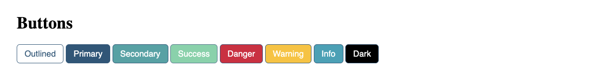

#### THE BEST CSS WRAMEWORK (2024)

 <pre>
          <code>
           &lt;button class="btn btn-primary"&gt; Primary &lt;/button &gt;

           &lt;button class="btn btn-secondary"&gt; Secondary &lt;/button&gt;

           &lt;button class="btn btn-success"&gt; Success &lt;/button&gt;

           &lt;button class="btn btn-danger"&gt; Danger &lt;/button&gt;

           &lt;button class="btn btn-info"&gt;Info&lt;/button&gt;

           &lt;button class="btn btn-dark"&gt;Dark&lt;/button&gt;
          </code>
          </pre>

<button>  <a href="./css/main.css"> DOWNLOAD THE BEST CSS FRAMEWOKR (2024) </a>  </button>